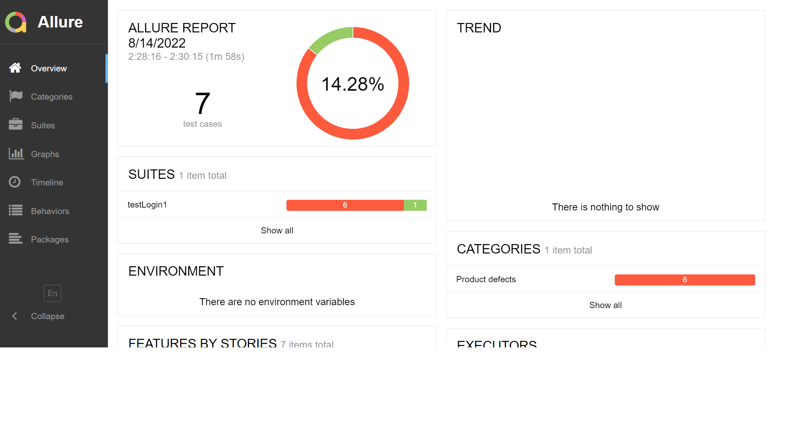
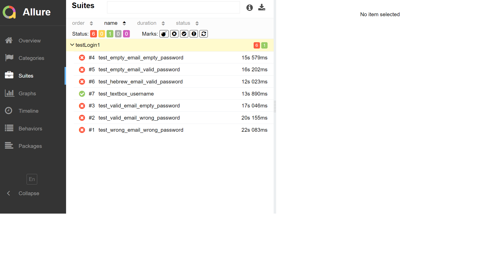
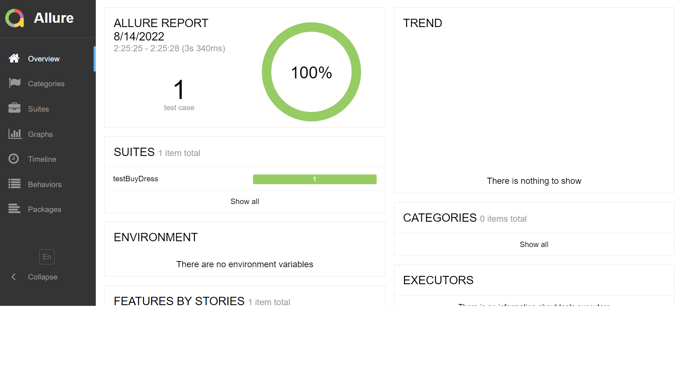
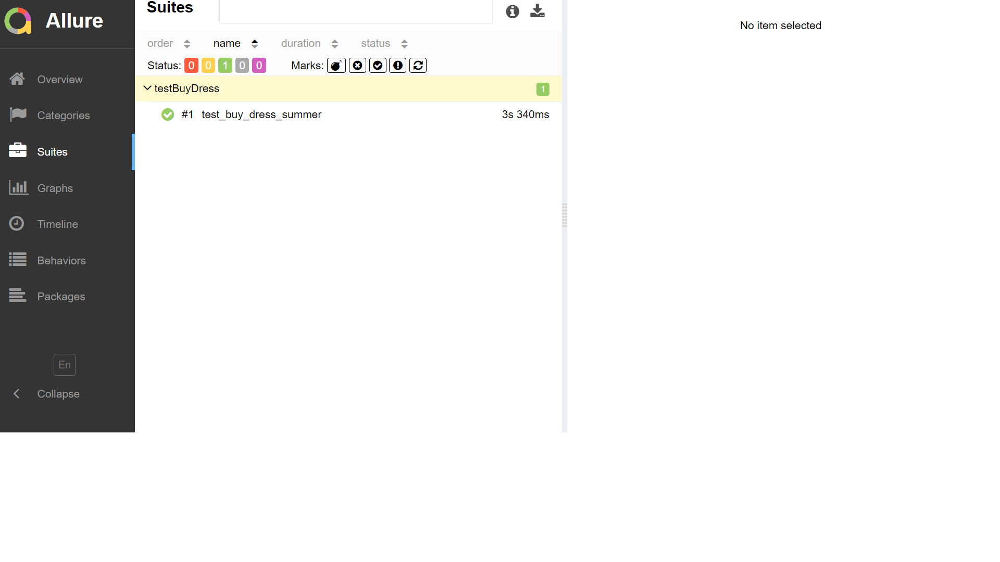

# Selenium
### by tamar samara


## test login allure:





## test Buy Dress allure:





## You can run all passed tests:

```sh
pytest .\testPet.py -k passed
```

## You can run all failed tests:

```sh
pytest .\testPet.py -k failed
```